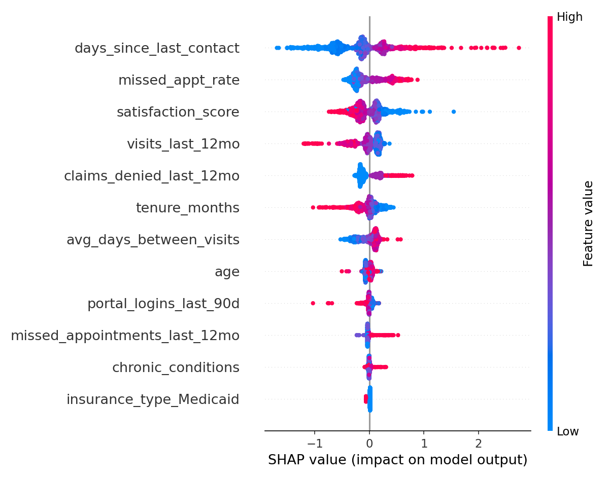

# Patient Churn Prediction

A machine learning pipeline that predicts which patients are likely to
disengage from care, using healthcare utilization and engagement signals
(visit history, missed appointments, claims friction, portal activity, and
satisfaction). Built to mirror the kind of patient-behavior modeling used
in healthcare analytics at companies like Optum/UnitedHealth Group.

## Why this matters

Healthcare organizations lose track of patients long before a formal
"churn" event — a missed appointment here, a denied claim there, declining
portal engagement — and by the time disengagement is obvious, it's often
too late for outreach to help. This project predicts churn risk *before*
that point, using signals that are available in most patient-engagement
systems, and explains *why* each prediction was made so care teams can act
on it.

## What it does

1. **Generates a synthetic but realistic patient dataset** — demographics,
   chronic conditions, utilization, claims, and engagement signals — with
   a calibrated churn label (~17.5% churn rate, in line with real
   healthcare attrition ranges). No real patient data is used.
2. **Runs exploratory data analysis** — churn rate by insurance type,
   contact-recency distributions, and a feature correlation heatmap.
3. **Engineers features** — missed-appointment rate, low-engagement flags,
   and contact-gap risk flags on top of the raw utilization data.
4. **Trains and compares three models** — Logistic Regression, Random
   Forest, and XGBoost — with grid-searched hyperparameters and 5-fold
   stratified cross-validation.
5. **Explains predictions with SHAP** — surfaces the top predictive
   drivers per model, not just an accuracy number.
6. **Scores new patients** — a standalone inference script that takes a
   CSV of patient records and returns churn probabilities, ranked
   highest-risk first.

## Results

| Model               | ROC-AUC | F1   |
|---------------------|---------|------|
| Logistic Regression | 0.718   | 0.415 |
| Random Forest        | 0.707   | 0.402 |
| XGBoost              | 0.704   | 0.402 |

The best-performing model (Logistic Regression, selected automatically by
ROC-AUC) is saved to `models/best_model.joblib`.

**Top predictive drivers (SHAP):**

1. `days_since_last_contact` — the single strongest signal; patients who
   haven't been reached in a while are markedly more likely to churn
2. `missed_appt_rate` — a high ratio of missed to attended appointments
3. `satisfaction_score` — lower satisfaction strongly predicts disengagement
4. `visits_last_12mo` — fewer visits raises churn risk
5. `claims_denied_last_12mo` — claims friction correlates with disengagement



## Project structure

```
patient-churn-prediction/
├── data/
│   └── patients.csv              # synthetic dataset (generated)
├── src/
│   ├── generate_data.py          # synthetic data generator
│   ├── features.py               # feature engineering + design matrix
│   ├── eda.py                    # exploratory data analysis + plots
│   ├── train.py                  # trains & compares 3 models, saves best
│   └── predict.py                # scores new patients with saved model
├── tests/
│   └── test_pipeline.py          # smoke tests for data + features
├── models/                       # saved model, scaler, feature list
├── reports/
│   ├── metrics.json              # model comparison results
│   ├── feature_importance.csv    # SHAP feature ranking
│   └── figures/                  # EDA + SHAP plots
└── requirements.txt
```

## Getting started

```bash
pip install -r requirements.txt

# 1. Generate the synthetic dataset
python src/generate_data.py --n_patients 6000 --out data/patients.csv

# 2. Explore the data
python src/eda.py --data data/patients.csv

# 3. Train and compare models
python src/train.py --data data/patients.csv

# 4. Score new patients
python src/predict.py --input data/new_patients.csv --output reports/predictions.csv

# Run tests
pytest tests/ -v
```

## Tech stack

Python · pandas · scikit-learn · XGBoost · SHAP · matplotlib/seaborn

## Notes on the data

This project uses a **synthetic dataset** generated with a calibrated
logistic churn signal (see `src/generate_data.py`) rather than real patient
records, for privacy and reproducibility. The feature set and modeling
approach are designed to generalize directly to real EHR/claims data with
the same schema.
